# RaceKit System for Meta Horizon Worlds 

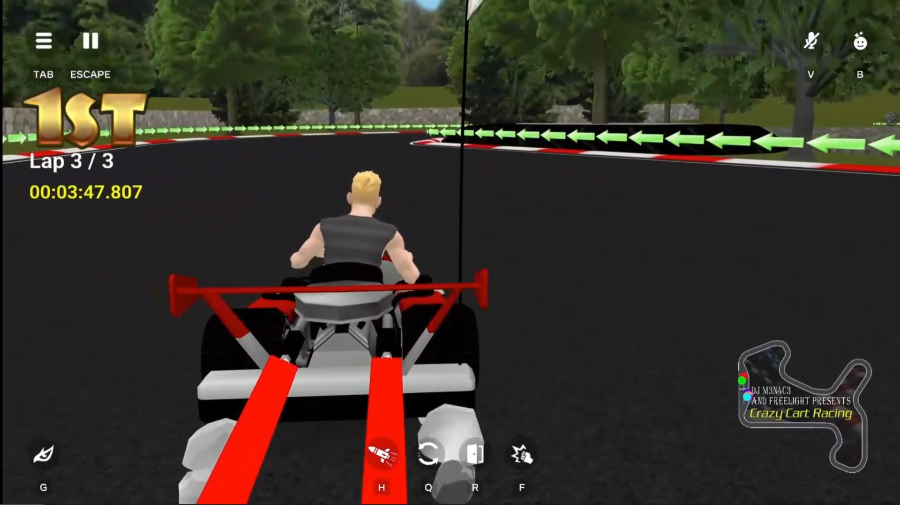
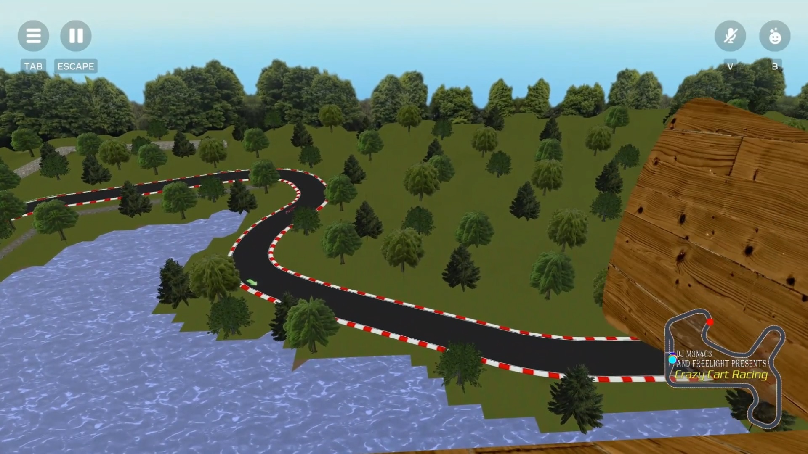
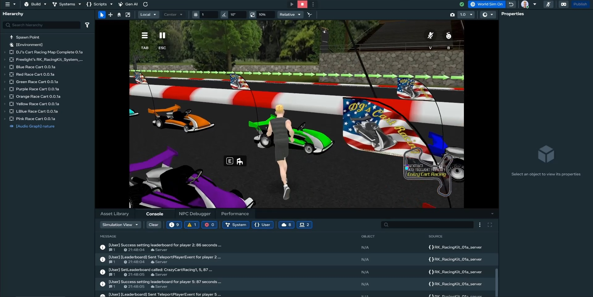
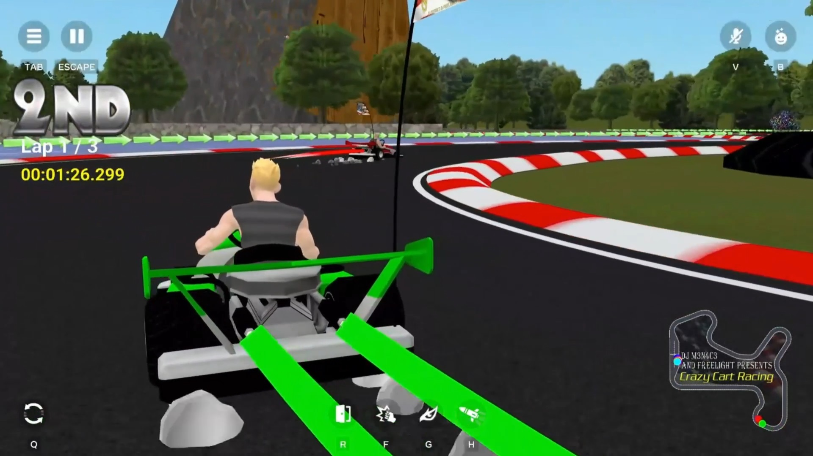

(⬆️ Click for YouTube Video!)

# Scripts and scene setup

This is a detailed explanation of how each script needed for this system works.  But don't worry, you can download the remixable world directly in Meta Horizon Worlds with it all setup and preconfigured, ready to go out of the box.  You can change out all of the original art we provided, or use use your own from the track to the scenery to the vehicle and projectiles.  They are all customizable.  Each piece of art used in this template system was created by DJ M3N4C3, and the scripting was done by free.light

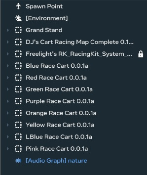

# Controller / Non-vehicle scripts - RootObject Hiearchy 

You should have a section for all of the race control and management stuff that looks like this. 

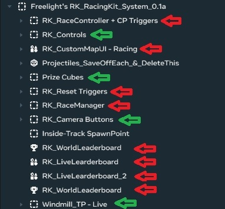

Red arrows marks objects that have a script on that transform (the top of each one), green arrows marks that some children of these objects have a script or scripts on them such as buttons, prize cubes, tp triggers, etc.

The projectiles section is meant for you to save off each one as a prefab, and then delete.   These objects in here are the templates for the projectile prefabs that get slotted into the ProjectileSpawner script inside each vehicle.

# Vehicle Object Hiearchy

You should have a hiearchy setup similar to what is shown below, for each vehicle object.   Each vehicle object should be in the root of the scene.  Each vehicle needs to be slotted into the RaceController script, as well as setup with corresponding color codes in the MapUIManager script that controls the livemap overlay seen in desktop, mobile & VR !

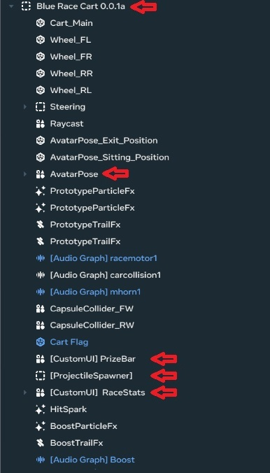

Red arrows marks objects that have a script on that transform (the top of each one of these children)

# Projectile Prefabs

Each projectile prefab, when changed, needs to be saved off as an inventory item, any overrides applied, and reslotted into the ProjectileSpawner on each vehicle before their spawned items will update.  This script, on a child of each vehicle, is also used as the spawnpoint for each vehicle, so take note we have them placed in front of and above, and slightly rotated so that items spawn correctly and don't hit ourself when doing so.  Each projectile prefab needs to have the `RK_ProjectileSpawner` script at the root of them.  Each projectile needs to have the 'vehicle' tag so they register collision with all of the vehicles colliders, as well as each vehicle and all of its colliders should have the 'vehicle' tag.. Each projectile can also optionally have the 'bolt', 'banana', or 'dart', or 'flatten'  tag too, and these will cause one of the 3 physics/scaling effects to occur to vehicles and their drivers when hit by objects with those tags !

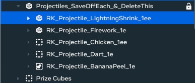

# Explanation of each non-vehicle script

# RK_RaceManager

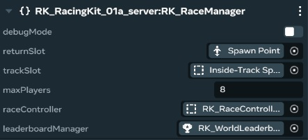

**Purpose:**

The `RK_RaceManager` script is responsible for managing player entry into a race, ensuring that the race doesn't exceed the maximum player limit and handling player teleportation to the starting position. This script is crucial for controlling who participates in a race and managing the transition from the lobby area to the racetrack and back. This is a server script.

**Scene Setup:**

1.  Create a new entity in your scene for all of the non-vehicle / system scripts, and create a child object in it for this script. This entity will host the `RK_RaceManager` script.  
2.  Create or designate one entity to serve as the return slot (`returnSlot`). This transform represents the location where players are teleported after the race finishes or they exit.
3.  Create or designate another entity to serve as the track slot (`trackSlot`). This is the location where players are teleported to when they join the race before it starts, should be near the vehicles.
4.  **Crucially**, ensure the "RK_RacingKit_local.ts file has its `Execution Mode` of set to **Default** in the Horizon Worlds script settings (this makes it run on the server).

**Properties:**

*   `debugMode` (Boolean, Default: `true`): Enables debug messages in the console. Useful for troubleshooting and monitoring the script's behavior.

*   `returnSlot` (Entity):  A *required* entity slot.  This should be assigned to an entity in your scene that represents the location where players are teleported after the race finishes or they leave the race. Make sure the position of this entity is correct.

*   `trackSlot` (Entity): A *required* entity slot. This should be assigned to an entity in your scene that represents the location where players are teleported to when they join the race. Ensure this entity's position is correctly placed at the starting line and near the vehicles on the racetrack.

*   `maxPlayers` (Number, Default: `8`): Sets the maximum number of players allowed to join the race (should match the number of available cars in the scene).  Once this limit is reached, no new players can enter until the race is finished or stopped and players are cleared.

*   `raceController` (Entity):  This should be linked to the `RK_RaceController` entity. The `RK_RaceManager` listens to the `RaceControlEvent` from the `RK_RaceController` to determine when the race starts and stops.

*   `leaderboardManager` (Entity):  Assign the `RK_LeaderboardUpdater` entity. This is used to manage and trigger player teleportation back to the starting area after the race finishes, but is the only one that can communicate with the TeleportPlayerEvent to send them home. It also sends an actual update to the built in leaderboard gizmo object that should also have the `RK_LeaderboardUpdater` script on it as well, its not just an empty game object, its a 'World Leaderboard" gizmo with our script on it.

**Usage Notes:**

*   **Player Join Flow:**
    1.  A player interacts with a `RK_RaceEntryButton` (described later).
    2.  The `RK_RaceEntryButton` sends a `RaceJoinEvent` to the `RK_RaceManager`.
    3.  The `RK_RaceManager` checks if the race is active, if the player is already in the race, and if the race is full.
    4.  If all checks pass, the player is added to the race and teleported to the `trackSlot`.
*   **Race Start/Stop Flow:**
    1.  The `RK_RaceController` sends a `RaceControlEvent` (either 'start' or 'stop') to the `RK_RaceManager`.
    2.  On 'start', the `RK_RaceManager` sets the `raceActive` flag.
    3.  On 'stop', the `RK_RaceManager` teleports all players in the race to the `returnSlot` and clears the `playersInRace` map.
*   Ensure that the `returnSlot` and `trackSlot` entities have stable positions. If these entities move during gameplay, the teleport destinations will change unexpectedly.
*   Set the execution mode of this script to **Default** (RK_RacingKit_local.ts)
*   If you dont have the racecontroller set up at the same time, then the RaceManager will not properly receive TeleportPlayerEvents for your players on race finish.

# RK_RaceEntryButton

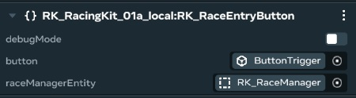

**Purpose:**

The `RK_RaceEntryButton` script provides a button or trigger that players can interact with to join a race managed by the `RK_RaceManager`. When a player enters the trigger area, a `RaceJoinEvent` is sent to the `RK_RaceManager`, requesting to add the player to the race. This is a LOCAL script.

**Scene Setup:**

1.  Create a new entity in your scene that will act as the "join button". This can be a simple cube or a more visually appealing object.
2.  Add a `TriggerGizmo` component to the button entity. Configure the trigger's size and shape to define the interaction area.
3.  Add the `RK_RaceEntryButton` script to the same entity as the `TriggerGizmo`.
4.  Ensure that the entity is interactable by players (e.g., the interaction mode is set to 'Physics'). It will automatically pick up the player upon trigger, so that is enough.

**Properties:**

*   `debugMode` (Boolean, Default: `true`): Enables debug messages in the console, providing information about button presses and join requests.

*   `button` (Entity): A *required* entity slot. This should be assigned to the *same* entity as the `TriggerGizmo`.  This is how the script accesses the trigger event.

*   `raceManagerEntity` (Entity):  A *required* entity slot. This should be assigned to the entity in your scene that has the `RK_RaceManager` script attached. This links the button to the race management system.

**Usage Notes:**

*   **Placement:** Place the button entity in a location that is easily accessible to players who want to join the race.
*   **Trigger Configuration:** Adjust the `TriggerGizmo` properties (size, shape) to create an appropriate interaction zone.
*   **Multiple Buttons:** You can have multiple `RK_RaceEntryButton` instances in your scene, all pointing to the same `RK_RaceManager`. This allows you to have multiple entry points to the race.
*   The `RaceJoinEvent` is sent using the player's *index* within the Horizon Worlds player list. This index is used by the `RK_RaceManager` to retrieve the `Player` object.

# RK_RaceController

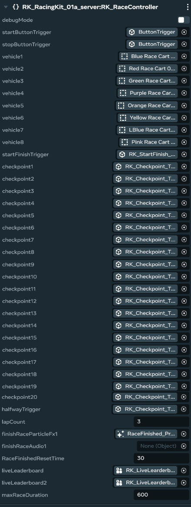

**Purpose:**

The `RK_RaceController` script manages the overall race flow, including starting and stopping the race, tracking vehicle progress, determining positions, and handling disqualifications. It also coordinates communication between vehicles and other systems, such as the leaderboard. This is a SERVER script.

**Scene Setup:**

1.  Create a new entity in your scene to host the `RK_RaceController` script. It's recommended to create a entity named "RaceController" and put it in your RacingKit system group.
2.  Designate or create entities for the start/finish line, checkpoints, and halfway trigger. These entities will act as triggers to track vehicle progress.
3.  Assign these triggers to the appropriate properties in the `RK_RaceController` script.
4.  Assign the vehicle entities to the `vehicle1`, `vehicle2`, etc., properties.
5.  Assign the `finishRaceAudio1` and `finishRaceParticleFx1` entities if you wish to play audio and particle effects on race completion.
6.  Set the `Execution Mode` of this script to **Default** in the Horizon Worlds script settings (this makes it run on the server) if using seperated scripts.

**Properties:**

*   `debugMode` (Boolean, Default: `true`): Enables debug messages in the console for troubleshooting and monitoring.

*   `startButtonTrigger` (Entity): Assign the entity with a `TriggerGizmo` that players can interact with to *start* the race.

*   `stopButtonTrigger` (Entity): Assign the entity with a `TriggerGizmo` that players can interact with to *stop* the race.

*   `vehicle1` - `vehicle8` (Entity):  Assign each of these slots to a vehicle entity (the root object of each vehicle). Up to 8 vehicles are supported.

*   `startFinishTrigger` (Entity):  The entity with a `TriggerGizmo` that represents the start/finish line.  Vehicles crossing this trigger (after passing the halfway point) increment their lap count.

*   `checkpoint1` - `checkpoint20` (Entity): Assign these slots to the entities with `TriggerGizmo` components that represent the checkpoints along the racetrack. These triggers are used to track vehicle progress within a lap. The order of these checkpoints is *crucial*.

*   `halfwayTrigger` (Entity): Assign this slot to the entity with a `TriggerGizmo` that represents the halfway point of the track. Vehicles must cross this trigger before their lap count will increment when crossing the `startFinishTrigger`.

*   `lapCount` (Number, Default: `3`): The number of laps required to complete the race.

*  `finishRaceParticleFx1` (Entity): A optional ParticleGizmo effect when the race is won.

*  `finishRaceAudio1` (Entity): A optional AudioGizmo effect when the race is won.

*   `RaceFinishedResetTime` (Number, Default: 15): Amount of time to wait before teleporting players back, so they can see the cool end of race effects/results.

*   `liveLeaderboard` (Entity): Leaderboard in the world to update in real time, must have `RK_LiveLeaderboard` script running, to see who is in what position.

*   `liveLeaderboard2` (Entity): Leaderboard in the world to update in real time, must have `RK_LiveLeaderboard` script running, to see who is in what position.

*   `maxRaceDuration` (Number, Default: `600`): The maximum time (in seconds) that a race can last before vehicles are automatically disqualified. Prevents races from going on indefinitely.

**Usage Notes:**

*   **Trigger Placement:** Accurate placement of the start/finish, checkpoint, and halfway triggers is essential for correct lap counting and position tracking. Ensure the triggers are sized appropriately to reliably detect vehicles passing through them.
*   **Checkpoint Order:** The order of the `checkpoint` entities in the properties drawer *must* match the order in which vehicles should pass through them on the racetrack.
*   **Vehicle Setup:** Ensure that each vehicle entity has a unique identifier.
*   **Race Flow:**
    1.  The race starts when a vehicle enters the `startButtonTrigger` area. A `RaceControlEvent` with the command 'start' is sent to all vehicles.
    2.  Vehicles progress through the checkpoints and the halfway trigger.
    3.  When a vehicle crosses the `startFinishTrigger` after passing the `halfwayTrigger`, its lap count is incremented.
    4.  When a vehicle completes the required number of laps (`lapCount`), it is marked as finished, and its finish position is recorded.
    5.  The race ends when all vehicles have finished or when the `stopButtonTrigger` is activated.
    6.  A `RaceControlEvent` with the command 'stop' is sent to all vehicles, which can trigger visual or audio effects on the vehicles.
* **Disqualification:** If a player does not move/drive in the race, or takes too long, they will get "dq'd"

# RK_SpectatorCamera

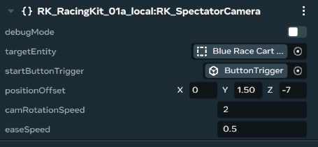
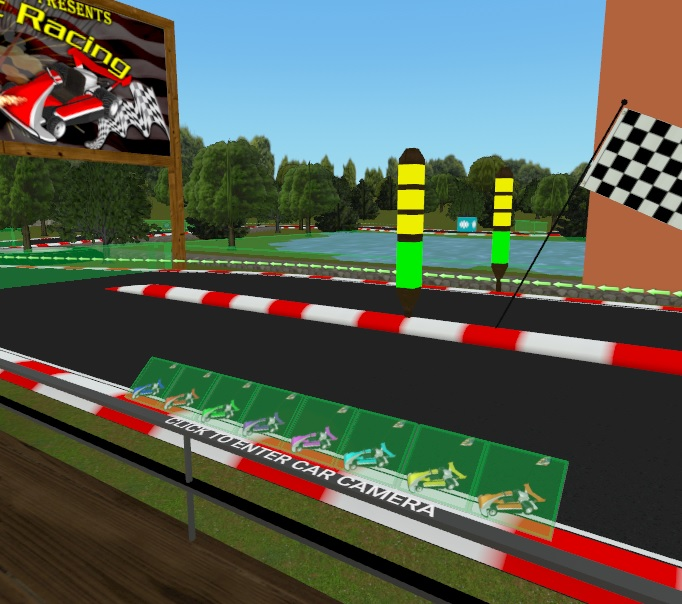

**Purpose:**

The `RK_SpectatorCamera` script provides a spectator view by attaching the local player's camera to a target entity, allowing them to observe the race from a dynamic perspective. When a player interacts with the spectator trigger button, the scripts attempts to transfer camera control (ownership) to the player. This is a LOCAL script.

**Scene Setup:**

1.  Create a new entity in your scene to act as the camera controller, like a button. This entity will host the `RK_SpectatorCamera` script. It can be an empty object or have a visual representation.
2.  Create or designate an entity to serve as the "SpectatorStartTrigger". This could be the camera button to activate the spectating.  Be sure to set it to "Interaction Prompt Icon: Interact" and "Selectable in Screen Mode" enabled. 
3. Assign this to the `startButtonTrigger` on the SpectatorCamera
4.  Create or designate an entity for the camera to "follow", in this case, that will be a vehicle entity. This should be one of the vehicles already added to the RaceController.

**Properties:**

*   `debugMode` (Boolean, Default: `false`): Enables debug messages in the console for troubleshooting and monitoring.

*   `targetEntity` (Entity): *This is a required field*. Assign one of your vehicle root objects as the target.

*   `startButtonTrigger` (Entity):  *This is a required field*. This should be a object with a TriggerGizmo attached to it. When a player enters this trigger, the Spectator camera will start for that player, following the targetEntity.

*   `positionOffset` (Vec3, Default: `(0, 1.5, -7.0)`):  Defines the position offset of the camera relative to the `targetEntity`. Adjust these values to fine-tune the camera's position behind the vehicle.

*   `camRotationSpeed` (Number, Default: `2`): The speed at which the camera rotates around the `targetEntity`. This controls how quickly the camera adjusts its orientation.

*   `easeSpeed` (Number, Default: `0.5`):  The speed at which the camera smoothly transitions to its target position and rotation. A higher value results in a faster transition.

**Usage Notes:**

*   **Trigger and Ownership:**
    *   When a player enters the `startButtonTrigger`, the script attempts to become owned by the entering player. It is owned when they are seeing through it.
    *   The script handles ownership transfers, ensuring that only one player controls the camera at a time. If a player gains ownership, the camera attaches to the `targetEntity` for that player. If the player loses ownership, they are returned to their original third-person camera mode.
*   **Placement and Visibility:** Place the camera controller entity in a location that makes sense for a spectator. The entity can be invisible, as it primarily functions as a script container.
*   **Multiple Cameras:** You can have multiple `RK_SpectatorCamera` instances in your scene, each following a different `targetEntity`.
* Ensure the execution mode is set to **Local**.
* **Exiting the camera:** Make sure to add an interactable button to give the spectator an easy exit button.

# RK_StartRace

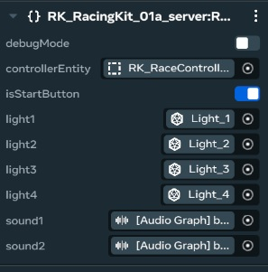

**Purpose:**

The `RK_StartRace` script is designed to act as the interactive start/stop button to trigger the race sequence, activating the start and stop functionality from the trigger.  The intention is that it also handles the display of a countdown. This script can go on any static object in the world that you wish to be the start, or the stop button. This is a SERVER script.

**Scene Setup:**

1.  Create a new entity in your scene to act as the start or stop button. This can be a simple cube with an attached mesh, or something that looks more button-like.
2.  Add a `TriggerGizmo` component to this entity. This defines the area players must enter to activate the button.
3.  Add the `RK_StartRace` script to the same entity.
4.  Ensure that the entity is interactable by players.

**Properties:**

*   `debugMode` (Boolean, Default: `false`): Enables debug messages in the console for troubleshooting.

*   `controllerEntity` (Entity): A *required* entity slot. This should be assigned to the entity in your scene that has the `RK_RaceController` script attached.  This is how the button communicates with the race management system.

*   `isStartButton` (Boolean, Default: `true`): A boolean value that determines whether this button is a *start* button (`true`) or a *stop* button (`false`).

*   `light1` - `light4` (Entity): Entity slots for entities that will blink/turn on, for the countdown indicator.
 *  `sound1` (Entity): Entity with an AudioGizmo for the start, and a countdown sound that is played on the countdown.
 *  `sound2` (Entity): Entity with an AudioGizmo for the start, and a start sound that is played when the countdown ends.

**Usage Notes:**

*   **Placement:** Place the button entity in a location that is easily accessible to players who want to start or stop the race.
*   **Trigger Configuration:** Adjust the `TriggerGizmo` properties (size, shape) to create an appropriate activation zone.
*   **Start/Stop Logic:**
    *   If `isStartButton` is `true`, entering the trigger area will initiate the race countdown, and then start the race.
    *   If `isStartButton` is `false`, entering the trigger area will stop the race immediately, this button does not have any 'owner check', so it should only be out and available when debugging, and not for public use -- at least hide it somewhere good if you leave it as it will end the race and can be abused by party poopers !
* When used as isStartButton is enabled, it has a safety check to make sure it does not restart the race or countdown while the race is active, and blocks accidental multiple race instances

# RK_ResetTriggerRelay

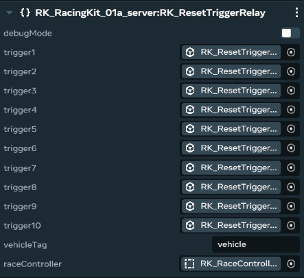

**Purpose:**

The `RK_ResetTriggerRelay` script is designed to work alongside the `RK_RaceController`. It listens for vehicles entering specific trigger areas on the race track and sends a "reset" message to the `RK_RaceController`, which then teleports the vehicle back to the last valid checkpoint. This helps players who have gone off-track or are significantly behind to get back into the race. This is a SERVER script.

**Scene Setup:**

1.  Create a new entity in your controller group to host the `RK_ResetTriggerRelay` script, a child object. A good practice is to create an empty object named "ResetTriggers" and make this new entity a child. The parent will hold children that are all setup as triggers.
2.  Create multiple trigger entities and position them in areas where players might need to reset (e.g., off-track areas, difficult corners, under water, a giant one under the whole map, etc).
3.  Add a `TriggerGizmo` component to each trigger entity.
4.  Assign these trigger entities to the `trigger1` - `trigger10` properties in the `RK_ResetTriggerRelay` script.
5. *Ensure* the `RK_ResetTriggerRelay` script exists above the actual `triggerX` objects (it's a "parent" object with all the Reset triggers as children).

**Properties:**

*   `debugMode` (Boolean, Default: `true`): Enables debug messages in the console.

*   `trigger1` - `trigger10` (Entity): Assign each of these properties to a trigger entity (an entity with a `TriggerGizmo` component) that will act as a reset zone.
* `vehicleTag` (String, Default: 'vehicle'): The entity tag to verify to make sure the object is a "vehicle".
*   `raceController` (Entity): A *required* entity slot. This should be assigned to the entity in your scene that has the `RK_RaceController` script attached.  This is how the button communicates with the race management system.

**Usage Notes:**

*   **Trigger Placement:** Position the trigger entities strategically in areas where players are likely to need a reset.
*   **Vehicle Tag:** The script only sends reset messages for entities that have the tag specified in the `vehicleTag` property. This prevents accidental resets of other objects.
*   When a vehicle enters a trigger area, its position and rotation are sent to the `RK_RaceController`, which then teleports the vehicle back to the last valid checkpoint.

# RK_LeaderboardUpdater

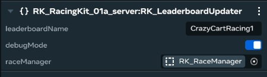

**Purpose:**

The `RK_LeaderboardUpdater` script is responsible for receiving race completion information (player ID and finish time) and updating the in-world leaderboard. It also handles teleporting the player to the designated return area after they finish the race. This script interacts with the Horizon Worlds leaderboard system. This is a SERVER script.

**Scene Setup:**

1.  Create or designate an entity in your scene to host the `RK_LeaderboardUpdater` script. This entity should be separate from the `RK_RaceController`.  Make sure the in-world leaderboard gizmo is a child.
2. Ensure that you are using the in-world leaderboard gizmo object from the Horizon Worlds toolbelt. This is required!
3. Also assign to the Leaderboard Updater's `raceManager` the current `RK_RaceManager` in the scene to ensure the code has its needed references.

**Properties:**

*   `leaderboardName` (String, Default: `"MyLeaderBoard"`):  The name of the leaderboard as it's configured in the Horizon Worlds leaderboard settings. *This name must match exactly* the name configured in the Horizon Worlds editor for your leaderboard.

*   `debugMode` (Boolean, Default: `true`): Enables debug messages in the console.

*    `raceManager` (Entity):  A *required* entity slot. This should be assigned to the entity in your scene that has the `RK_RaceManager` script attached.  This is how the button communicates with the race management system.

**Usage Notes:**

*   **Leaderboard Name:** *The `leaderboardName` property must exactly match the name of the leaderboard defined in the Horizon Worlds editor.* If the names do not match, the script will not be able to update the leaderboard.
*   **Data Flow:**
    1.  When a vehicle completes the race, the `RK_RaceController` sends a custom `playerLBEvent` to the `RK_LeaderboardUpdater`. This event contains the player's ID and their finish time.
    2.  The `RK_LeaderboardUpdater` receives the event and retrieves the `Player` object using the player ID.
    3.  The script then calls the `world.leaderboards.setScoreForPlayer()` method to update the leaderboard with the player's score (finish time).

* Make sure to set the Execution Mode of this script to **Default**.

* The Leaderboard updater is also in charge of telling the raceManager to teleport you after you have finished and added your name to the board!

# RK_MapUIManager

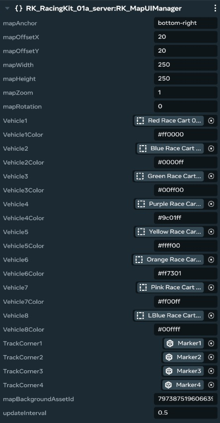

**Purpose:**

The `RK_MapUIManager` script is responsible for displaying a live map in the UI, showing the positions of vehicles on the racetrack. It calculates the positions of vehicles relative to the track corners and updates the UI accordingly. It's a UI component, like the prize bar, that shows real time race info. This is a SERVER script.

**Scene Setup:**

1.  Add a UI Gizmo object to your scene. This object will be the anchor and root to displaying the map in world.
2.  Select the Panel Height and Width, but typically this is a smaller object, so 256,256 will work perfectly. You may also need to select the world scale to a very low value, to display it in world to players, start with "0.05".
3.  Create four entities in your scene to represent the corners of the racetrack. These entities should be placed at strategic points along the track to define the map's boundaries. The first three points are required, and the last is calculated.
4. Add the `RK_MapUIManager` script to the UI object, and slot in `TrackCorner1`, `TrackCorner2`, and `TrackCorner3` in world space.
5.  Create any number of vehicle root objects (each with basic collision) and add them to the available slots as required.
6.  Make sure to add a world space texture, and set the id correctly for a map image display as a background.
7. The execution mode is **Server**.

**Properties:**

*   `mapAnchor` (String, Default: `'bottom-right'`):  Specifies the anchor point for the UI element on the screen. Valid values are: `'top-left'`, `'top-right'`, `'bottom-left'`, `'bottom-right'`, `'center'`.

*   `mapOffsetX` (Number, Default: `20`): The horizontal offset of the UI element from the anchor point, in pixels.

*   `mapOffsetY` (Number, Default: `20`): The vertical offset of the UI element from the anchor point, in pixels.

*   `mapWidth` (Number, Default: `400`): The width of the UI element, in pixels.

*   `mapHeight` (Number, Default: `400`): The height of the UI element, in pixels.

*   `mapZoom` (Number, Default: `1`): Controls the zoom level of the map. A value greater than 1 will zoom in, while a value less than 1 will zoom out.

*   `mapRotation` (Number, Default: `0`): The rotation of the map, in degrees.

*   `Vehicle1` - `Vehicle8` (Entity): Assign each of these to the "Vehicle Root object", that each player is driving. That way you can track the vehicles using the root.

*   `Vehicle1Color` - `Vehicle8Color` (String, Default: a wide variety of Hex codes): Here you will want to set a hex code for the vehicles to have a specific color and not just be a generic white circle on the map.

*   `TrackCorner1` (Entity): This is the first track point in world that will calculate the vehicles location to display on the map.

*   `TrackCorner2` (Entity): This is the second track point in world that will calculate the vehicles location to display on the map.

*   `TrackCorner3` (Entity): This is the third track point in world that will calculate the vehicles location to display on the map.

*   `mapBackgroundAssetId` (String, Default: `'1961935444377212'`): The asset ID of the texture to use as the map background.

*   `updateInterval` (Number, Default: `0.25`): The time interval (in seconds) between map updates. A smaller value will result in more frequent updates but may impact performance, suggested value is 1.0 (once per second) or higher

**Usage Notes:**

*   **Track Corners:** The positions of the `TrackCorner` entities are used to define the coordinate system for the map. Accurate placement of these entities is essential for correct vehicle positioning on the map.

*   **Performance:** The `updateInterval` property can impact performance. If you experience performance issues, try increasing this value. This is due to calculating the positions of each vehicle and re-drawing them to the new position, in 2D space.

# RK_LiveLeaderboard

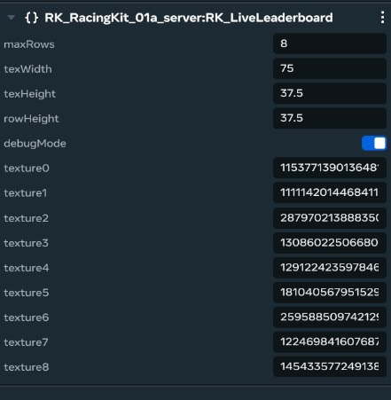

**Purpose:**

The `RK_LiveLeaderboard` script displays a real-time leaderboard showing the current standings of racers during an active race. It receives position updates from the `RK_RaceController` and updates a UI element with the current rankings. The UI portion is made of the UI gizmo from Horizons, not the 'Leaderboard gizmo', its called 'Custom UI' gizmo. This is a SERVER script.

**Scene Setup:**

1. Create a new UI Gizmo object to display your leaderboard, this will be the parent of the Leaderboard, in scene. Ensure that this is not too big, the maximum rows is the most important factor. A small amount of testing will ensure this UI object displays properly in the world and nothing is cropped.
2. You will also need to set a world scale in the X, Y and Z, in the top panel where you can set the name. This will ensure you can actually see this object in the world, you can start with something small like, "0.05"
3. Add the `RK_LiveLeaderboard` script to the UI Gizmo object in world.

**Properties:**

*   `maxRows` (Number, Default: `8`): The maximum number of rows to display on the leaderboard. This determines how many racers will be shown in the UI at any given time.

*   `texWidth` (Number, Default: `50`): The width of each player position indicator (texture), in pixels.

*   `texHeight` (Number, Default: `37.5`): The height of each player position indicator (texture), in pixels.

*   `rowHeight` (Number, Default: `37.5`): The height of each row in the leaderboard UI, in pixels. This value affects how players are spaced on the board.

*   `debugMode` (Boolean, Default: `false`): Enables debug messages in the console for troubleshooting.

*   `texture0` (String, Default: `'0'`): Not used, but must exist as a variable, due to a weird "Horizon property drawer" thing.

*   `texture1` - `texture8` (String, Default: `'0'`): The asset ID of the texture to use for each ranking (1st, 2nd, 3rd, etc.). The texture for the top player is `texture1`, second is `texture2`, and so on. If left at "0" no position display will show, but you will still see the players name.

**Usage Notes:**

*   **Data Flow:**
    1.  The `RK_RaceController` script calculates the current positions of all racers and sends this information to the `RK_LiveLeaderboard` script using a network event. You MUST add a `LiveLeaderboard` object to your scene, and set that on the race controller, or this process is not possible.
    2.  The `RK_LiveLeaderboard` script receives the position updates and updates its UI to reflect the current standings.

* The Execution mode should be **Server**

* If the display of the leaderboard gets goofy while in editor mode, it's probably from the script getting recompiling, and I think this might be an editor bug, but unsure at this time.  The way to fix it is to simply restart the editor server instance by going to 'Shutdown Server' and just going back into edit the same world.  I have never seen this bug occur at runtime / in-world though thankfully.

# RK_TeleportPlayer

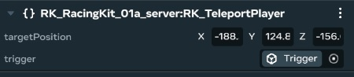

**Purpose:**

The `RK_TeleportPlayer` script provides a simple way to teleport a player to a predefined location in the world when they enter a specific trigger area. This script can be used to move players between different areas of your experience or to reset their position. This is a SERVER script, to ensure the teleport is done by the server.

**Scene Setup:**

1.  Create a new entity in your scene to act as the teleport trigger.
2.  Add a `TriggerGizmo` component to this entity. Configure the trigger's size and shape to define the activation area.
3.  Add the `RK_TeleportPlayer` script to the same entity.

**Properties:**

*   `targetPosition` (Vec3): *This is a required field*. The world coordinates to which the player will be teleported when they enter the trigger area.

*   `trigger` (Entity): *This is a required field*. Set the assigned trigger object in the scene to this slot.

**Usage Notes:**

*   **Trigger Configuration:** Adjust the `TriggerGizmo` properties (size, shape) to create an appropriate activation zone.

*   When using the copy/paste transform position values from marker game objects, please be sure that marker object is not a child of anything, or you might incorrectly grab local positions and this script is expecting world position cordinates of on the targetPosition property!  If it isn't teleporting to the correct location, this is probably why.

# RK_RotateCube

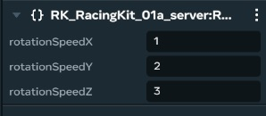

**Purpose:**

The `RK_RotateCube` script provides a simple way to animate an entity by continuously rotating it around its X, Y, and Z axes. While the name suggests a cube, it can be applied to any entity. This is a SERVER script.

**Scene Setup:**

1.  Create or select an entity in your scene that you want to rotate.
2.  Add the `RK_RotateCube` script to this entity.

**Properties:**

*   `rotationSpeedX` (Number, Default: `10`): The speed of rotation around the X-axis, in degrees per second.

*   `rotationSpeedY` (Number, Default: `20`): The speed of rotation around the Y-axis, in degrees per second.

*   `rotationSpeedZ` (Number, Default: `30`): The speed of rotation around the Z-axis, in degrees per second.

**Usage Notes:**

*   **Customization:** Experiment with different values for `rotationSpeedX`, `rotationSpeedY`, and `rotationSpeedZ` to achieve the desired rotation effect.
*   **Application:** This script is suitable for adding visual interest to your scene, such as rotating decorations or displaying prizes.

# RK_PrizeTrigger

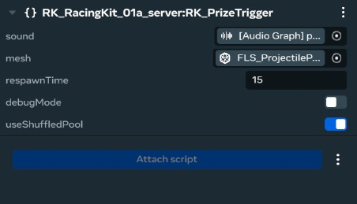

**Purpose:**

The `RK_PrizeTrigger` script creates a trigger area that, when entered by a vehicle, awards the vehicle a prize and then respawns after a delay. This is a SERVER script.

**Scene Setup:**

1.  Create a new entity in your scene to act as the prize trigger.
2.  Add a `TriggerGizmo` component to this entity. Configure the trigger's size and shape to define the area where players can collect the prize.
3.  Add the `RK_PrizeTrigger` script to the same entity.
4.  Optionally, add a mesh to the entity to visually represent the prize. Assign this mesh to the `mesh` property of the script.

**Properties:**

*   `sound` (Entity): A entity with an AudioGizmo to play when the trigger is activated, and the prize is collected.

*   `mesh` (Entity): Assign a Mesh object in the scene to use for the prize itself, so it can dissapear upon trigger.

*   `respawnTime` (Number, Default: `30`): The amount of time (in seconds) after the prize is collected before the trigger becomes active again and the mesh is respawned.

*   `debugMode` (Boolean, Default: `false`): Enables debug messages in the console.

*   `useShuffledPool` (Boolean, Default: `true`):

    *   If `true`, the script will use a shuffled pool of prizes, ensuring that each prize is awarded once before any prize is repeated. This provides a "fairer" distribution of prizes.
    *   If `false`, the script will randomly select a prize each time the trigger is activated, which may result in some prizes being awarded more frequently than others.

**Usage Notes:**

*   **Placement:** Place the trigger entity in a location that is accessible to vehicles on the racetrack.
* The assigned sound entity should have a AudioGizmo on it. This sound will play when you trigger the object.
* The trigger will only work ONCE! Be sure to set a respawn timer to allow the object to be re-triggered.

# The Vehicle Objects hiearchy & and their scripts

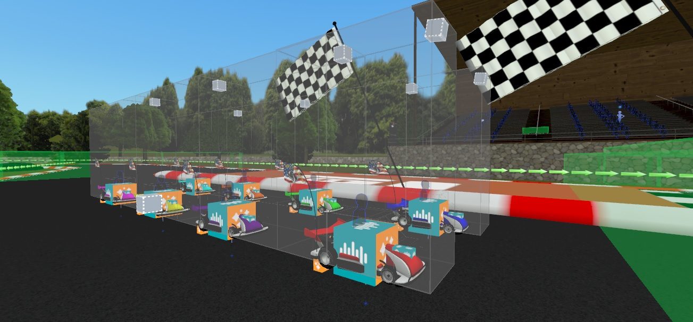

# RK_VehicleScript_1a

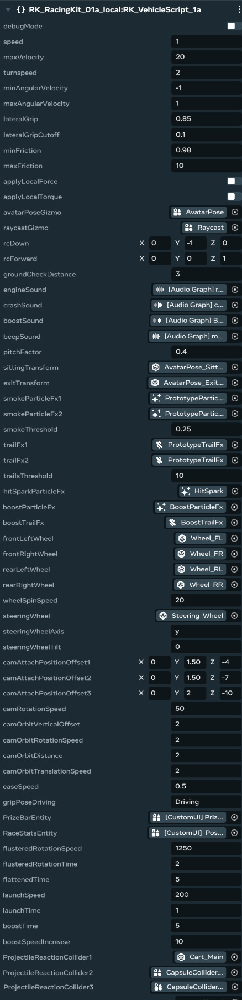

**Purpose:**

The `RK_VehicleScript_1a` script provides the core driving functionality for a vehicle. It handles player input, movement, physics, sound effects, camera control, and interactions with other objects. This is a LOCAL script.

**Scene Setup:**

1.  Create a new entity in your scene to represent the *root* of your vehicle. This entity will host the `RK_VehicleScript_1a` script. The name of this object does not matter, only what is slotted into the public fields. The object requires collision, and a collision object to react with.
2.  Create a hierarchy of child entities within the vehicle entity. This hierarchy should include:
    *   Visual components (meshes, etc.)
    *   Collision volumes
    *   Wheel entities (for visual animation)
    *   An `AvatarPoseGizmo` (sitpoint)
    *   An audio source for the engine sound
    *   Particle effect emitters
3.  Assign the appropriate child entities to the corresponding properties in the `RK_VehicleScript_1a` script.
4.  To get interaction to work, the car also needs a basic collision volume for people to interact with.

**Properties:**

*   `debugMode` (Boolean): Enables debug messages in the console for troubleshooting and monitoring.

*   `speed` (Number, Default: `1`): The acceleration rate of the vehicle (how quickly it reaches top speed).

*   `maxVelocity` (Number, Default: `20`): The maximum speed of the vehicle.

*   `turnspeed` (Number, Default: `1`): The rate at which the vehicle turns.

*   `minAngularVelocity` (Number, Default: `-1`): The minimum rate at which the vehicle turns.

*   `maxAngularVelocity` (Number, Default: `1`): The maxiumum rate at which the vehicle turns.

*   `lateralGrip` (Number, Default: `0.85`): Controls the amount of grip the tires have, preventing sliding. A higher value means more grip.

*   `lateralGripCutoff` (Number, Default: `0.1`): The speed at which lateral grip starts to take effect. Below this speed, there is no lateral grip.

*   `minFriction` (Number, Default: `0.98`): The minimum rate that the vehicles speed will decay.

*   `maxFriction` (Number, Default: `10`): The maximum rate that the vehicles speed will decay, if the car is moving faster.

*   `applyLocalForce` (Boolean): **Unused**, but must exist for property drawer reasons.

*   `applyLocalTorque` (Boolean): **Unused**, but must exist for property drawer reasons.

*   `avatarPoseGizmo` (Entity): A *required* Entity slot. Assign the AvatarPoseGizmo (sitpoint) entity inside of this vehicle. This is used to teleport and move the avatar into the car. This object requires collision and interaction.

*   `raycastGizmo` (Entity): *This is a required field*. Add the Raycast object to the field to measure ground collision. It uses raycasts, instead of collisions, so the car can easily slide on the ground and look natural.

*   `rcDown` (Vec3, Default: `(0, -1, 0)`): The direction that the raycast object should perform its measurements downwards.

*   `rcForward` (Vec3, Default: `(0, 0, 1)`): The direction that the raycast object will look forward.

*   `groundCheckDistance` (Number, Default: `2.0`): Controls how far down to measure.

*   `engineSound` (Entity): A *required* Entity slot for the object with the AudioGizmo to use for the cars engine, as it drives.

*   `crashSound` (Entity): A *required* Entity slot for the object with the AudioGizmo to use for collision effects.

*   `boostSound` (Entity): A *required* Entity slot for the object with the AudioGizmo to use for the cars boost, when enabled.

*   `beepSound` (Entity): A *required* Entity slot for the object with the AudioGizmo to use for the cars honk.

*   `pitchFactor` (Number, Default: `0.02`): Controls the amount of pitch on the engine sound to apply.

*  `sittingTransform` (Entity): A *required* transform for the avatar when sitting in the vehicle seat object. Must be attached to a transform that exists in the vehicle scene.

*  `exitTransform` (Entity): A *required* transform for the avatar for reverting back to the players normal position.

*   `smokeParticleFx1` (Entity): A *required* Particle gizmo that plays smoke when the object gets above a specified threshold.

*   `smokeParticleFx2` (Entity): A *required* Particle gizmo that plays smoke when the object gets above a specified threshold.

*   `smokeThreshold` (Number): A number specifying at which point when driving fast, the particle effects for smoke to be enabled.

*   `trailFx1` (Entity): An object that will display a texture behind the wheels when driving. Typically set to the particle emitter on that wheel object.

*   `trailFx2` (Entity): An object that will display a texture behind the wheels when driving. Typically set to the particle emitter on that wheel object.

*   `trailsThreshold` (Number): A number specifying at which point when driving fast, the particle effects for trails to be enabled.

*   `hitSparkParticleFx` (Entity): Used when the car crashes, a spark particle effect occurs on the cars main collision object.

*   `boostParticleFx` (Entity): The partical boost when an object has the tag of booster and they interact to obtain the boost.

*   `boostTrailFx` (Entity): The trail effect that spawns when boosted

*   `frontLeftWheel` (Entity): Entity for the physical front left wheel.

*   `frontRightWheel` (Entity): Entity for the physical front right wheel.

*   `rearLeftWheel` (Entity): Entity for the physical rear left wheel.

*   `rearRightWheel` (Entity): Entity for the physical rear right wheel.

*   `wheelSpinSpeed` (Number, Default: `5`): The multiplier that will be used to determine how fast wheels rotate

*   `steeringWheel` (Entity): The steering wheel object.

*   `steeringWheelAxis` (String, Default: `'y'`): The axis around which the steering wheel rotates. Valid values are `'x'`, `'y'`, and `'z'`.

*   `steeringWheelTilt` (Number, Default: `0`): **Unused**, but must exist for property drawer reasons.

*   `camAttachPositionOffset1` (Vec3, Default: `(0, 0.75, -3.0)`): Defines the position offset for the first attach camera.

*   `camAttachPositionOffset2` (Vec3, Default: `(0, 1.0, -7.0)`): Defines the position offset for the second attach camera.

*   `camAttachPositionOffset3` (Vec3, Default: `(0, 1.5, -10.0)`): Defines the position offset for the third attach camera.

*   `camRotationSpeed` (Number, Default: `2`): The speed at which the attach cameras rotate around the vehicle.

*   `camOrbitVerticalOffset` (Number, Default: `2`): The vertical offset for the orbit camera.

*   `camOrbitRotationSpeed` (Number, Default: `2`): The rotation speed for the orbit camera.

*   `camOrbitDistance` (Number, Default: `2`): The distance from the vehicle for the orbit camera.

*   `camOrbitTranslationSpeed` (Number, Default: `2`): The translation speed for the orbit camera.

*   `easeSpeed` (Number, Default: `0.5`): The speed at which the camera smoothly transitions between different modes (third-person, first-person, attach).

*   `gripPoseDriving` (String, Default: `'Driving'`): The avatar grip pose to use when the player is driving the vehicle.

*   `PrizeBarEntity` (Entity): A *required* entity slot. Assign a reference to the in world PrizeBar gizmo UI object. This script is where it gets added as a child to the avatar pose gizmo on driver.

*   `RaceStatsEntity` (Entity): A *required* entity slot. Assign a reference to the in world RaceStats gizmo UI object. This script is where it gets added as a child to the avatar pose gizmo on driver.

*   `flusteredRotationSpeed` (Number, Default: `5`): The speed at which the car rotates around the Y-axis when flustered mode is enabled.

*   `flusteredRotationTime` (Number, Default: `5`): The amount of time for how long the car should be spinning when in the "Flustered mode", caused by a banana hit.

*   `flattenedTime` (Number, Default: `5`): The amount of time the car and avatar should be squashed for when interacting with a flatten power up.

*   `launchSpeed` (Number, Default: `5`): The amount of upward speed the car is shot upwards, when used with the "dart" powerup.

*   `launchTime` (Number, Default: `5`): The total time that the launch goes up.

*   `boostTime` (Number, Default: `5`): The total amount of time that boost is applied on the car when the car rolls over the "boost" pickup.

*   `boostSpeedIncrease` (Number, Default: `10`): The amount of extra speed to be applied to the car when "boosted".

*`ProjectileReactionCollider1` - `ProjectileReactionCollider5` (Entity):  Add the five collider objects to be used for detecting "Power Up" triggers and "Projectile's" hitting them, incase your vehicle has more than one collider, like the default carts that come with this kit in the Remixable World template

**Usage Notes:**

*   **Hierarchy:** The vehicle entity and its child entities must be set up correctly for the script to function properly. Ensure that all required entities (wheels, audio source, particle emitters, etc.) are assigned to the appropriate properties.

*   **Collision:** The vehicle entity must have a collision volume so that it can interact with the environment and other objects.

*   **Camera Control:** The script provides several camera modes (third-person, first-person, attach, orbit). Players can switch between these modes using an input action.

# RK_AvatarPoseGizmoController

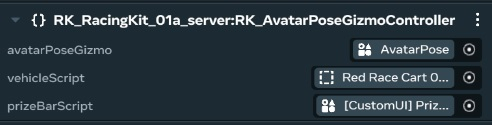

**Purpose:**

The `RK_AvatarPoseGizmoController` script manages ownership of certain components within a vehicle when a player sits in the AvatarPoseGizmo (sitpoint). This ensures that the local components (like the PrizeBar and PositionOverlay) are owned by the player currently driving the vehicle. This is a SERVER script.

**Scene Setup:**

1.  This script should be placed on the same object as an AvatarPoseGizmo (usually located as a child object on the Vehicle).
2.  You can add this to the AvatarPoseGizmo Controller object (the main seat).
3.  Assign the local root scripts you wish to be owned when a player drives the vehicle, like the RK_PrizeBar, or the Vehicle Root in scene.

**Properties:**

*   `avatarPoseGizmo` (Entity): A *required* Entity slot, and the reason this needs to be on its own AvatarPoseGizmo child object. Add the parent's `AvatarPoseGizmo` field here.

*   `vehicleScript` (Entity):  A *required* Entity slot. Assign to this variable the root object for the vehicle in question.

*   `prizeBarScript` (Entity): A *required* Entity slot. Assign to this variable the in world PrizeBar Gizmo UI object, that exists local to the vehicle that you want to be owned and shown on drive by any driver.

**Usage Notes:**

*   This is a simple object, in that it just makes it "Easier to work with the ownership" of the required local systems for each vehicle.

# RK_RacePositionOverlay

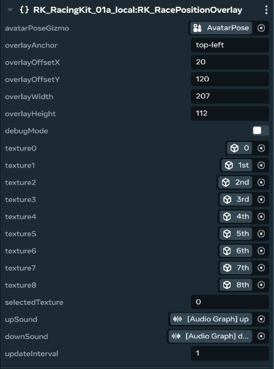

**Purpose:**

The `RK_RacePositionOverlay` script displays a UI element on the screen showing the player's current position in the race, their lap progress, and the race timer. It provides real-time feedback to the player during the race. A server time is set from this script to sync vehicle times/positions/etc if they swap vehicles mid-race. This script must be used on a UI Gizmo Object child object in the vehicle. This is a LOCAL script.

**Scene Setup:**

1.  Create a new entity in your scene, and add a UI Gizmo to it. Select a panel size that will be suitable for seeing a timer and race stats. This entity will host the `RK_RacePositionOverlay` script.
2.  Link the AvatarPoseGizmo (sitpoint) in the target vehicle to the `AvatarPoseGizmo` field in this script.

**Properties:**

*   `avatarPoseGizmo` (Entity): *This is a required field*. Link the AvatarPoseGizmo (sitpoint) on the vehicle this UI is for.

*   `overlayAnchor` (String, Default: `'top-right'`):  Specifies the anchor point for the UI element on the screen. Valid values are: `'top-left'`, `'top-right'`, `'bottom-left'`, `'bottom-right'`, `'center'`, `'center-left'`, `'center-right'`, `'center-top'`, `'center-bottom'`, `'center-only'`.

*   `overlayOffsetX` (Number, Default: `20`): The horizontal offset of the UI element from the anchor point, in pixels.

*   `overlayOffsetY` (Number, Default: `20`): The vertical offset of the UI element from the anchor point, in pixels.

*   `overlayWidth` (Number, Default: `400`): The width of the UI element, in pixels.

*   `overlayHeight` (Number, Default: `300`): The height of the UI element, in pixels.

*   `debugMode` (Boolean, Default: `false`): Enables debug messages in the console.

*   `texture0` - `texture8` (Asset):  These are the textures to display to show your position in the race. Texture0 will be for position 0, and so on.

*   `selectedTexture` (Number, Default: `0`): The initial texture (position) to display when the UI is first loaded.

*   `upSound` (Entity): A entity with an AudioGizmo to play when the player has gained ground.

*   `downSound` (Entity): A entity with an AudioGizmo to play when the player has lost ground.

*   `updateInterval` (Number, Default: `1.0`): How often to update the time, a lower value will result in better accuracy, but at a higher performance cost.

**Usage Notes:**

*   **Time Synchronization:** The script uses network events to synchronize the race timer across all clients, ensuring consistent timing.
* The Execution mode is **Local**.

# RK_PrizeBar

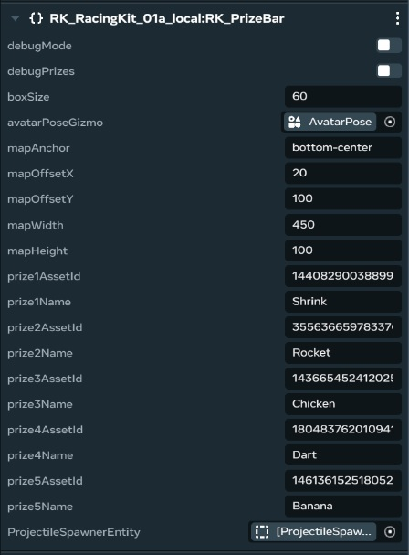

**Purpose:**

The `RK_PrizeBar` script provides a user interface (UI) element that displays the prizes a player has collected. Players can select and use these prizes. It manages the UI for displaying prize quantities, handling prize selection, and sending messages to activate selected prizes. This script must be used on a UI Gizmo Object in world. This is a LOCAL script.

**Scene Setup:**

1.  Create a new `UI Gizmo` entity in your scene. This entity will host the `RK_PrizeBar` script. Make sure you have set the panel width and height correctly, so all UI elements properly display on the panel itself.
2. The prizeBar will want a link to where players will sit so the UI can be shown when there is a driver inside a vehicle. Create an AvatarPoseGizmo (sitpoint) on your target object to be the main object that can show the UI in world.
3.  Link this main object to the AvatarPoseGizmo entity.

**Properties:**

*   `debugMode` (Boolean): Enables debug messages in the console.
*   `debugPrizes` (Boolean): when you join the car for the first time, gives you each prize up to 10.
*   `boxSize` (Number, Default: 60): Sets the size of each prize display box in the UI.

*   `avatarPoseGizmo` (Entity): A *required* entity slot. Assign the `AvatarPoseGizmo` (sitpoint) in the vehicle this prize bar is for. This allows the Prizebar UI to be displayed to the driver of that vehicle (via avatarPoseGizmo.player.set). This means, each car will have its own prizebar in world.

*   `mapAnchor` (String, Default: `'bottom-right'`): Specifies the anchor point for the UI element on the screen.  Valid values are: `'top-left'`, `'top-right'`, `'bottom-left'`, `'bottom-right'`, `'top-center'`, `'bottom-center'`, `'center'`.

*   `mapOffsetX` (Number, Default: `20`):  The horizontal offset of the UI element from the anchor point, in pixels.

*   `mapOffsetY` (Number, Default: `20`): The vertical offset of the UI element from the anchor point, in pixels.

*   `mapWidth` (Number, Default: `450`): The width of the UI element, in pixels.

*   `mapHeight` (Number, Default: `100`): The height of the UI element, in pixels.

*   `prize1AssetId` - `prize5AssetId` (String): The asset ID of the texture to use for each prize in the UI.

*   `prize1Name` - `prize5Name` (String, Default: `'Prize 1'`):  The name to display for each prize in the UI.

*   `ProjectileSpawnerEntity` (Entity): This is the entity that will spawn the projectiles into the world. The `RK_ProjectileSpawner` is spawned from here, using a "custom message" sent to that entity from this script.

**Usage Notes:**

*   **UI Layout:** Adjust the `mapAnchor`, `mapOffsetX`, `mapOffsetY`, `mapWidth`, and `mapHeight` properties to position the UI element appropriately on the screen.
*   **Prize Assets:** Make sure the asset IDs for the prize textures are correct and that the assets are loaded in your world.
*   **Button Binding:** The script binds input actions to select and spawn prizes.  These input bindings are automatically handled when a player enters the `AvatarPoseGizmo` trigger.
* The execution mode is **Local**.

# Projectile Objects & and their script

# RK_ProjectileSpawner

**Purpose:**

The `RK_ProjectileSpawner` script is responsible for spawning projectile entities 'prizes' from the 'prizebar' (prefabs) into the world when it receives a message from another script, such as the `RK_PrizeBar`. It manages the spawning process, applies a force to the projectiles, and automatically destroys them after a timeout. A very common need, is on the vehicles root, to spawn "power ups" for the vehicles. This is a SERVER script.

**Scene Setup:**

1.  Create a new entity in your vehicle to host the `RK_ProjectileSpawner` script. This entity will act as the projectile spawn point.
2.  Assign the desired projectile prefabs to the `prefab1` - `prefab5` properties.
3.  Adjust the `prefab1Velocity` - `prefab5Velocity` properties to control the initial speed of each projectile.

**Properties:**

*   `debugMode` (Boolean): Enables debug messages in the console for troubleshooting.

*   `prefab1` - `prefab5` (Asset):  These properties are the projectile objects you want to spawn in the world. For instance, you can have a Prefab of a lightning bolt, a banana, a dart, etc. These objects must be created somewhere else and imported in.

*   `prefab1Velocity` - `prefab5Velocity` (Number, Default: `60`): The speed (in units per second) at which each prefab should be launched when spawned. A higher value means the projectile will travel faster. Set to `0` for non-projectile effects that are to occur where the driver spawns them.

*   `destroyTimeout` (Number, Default: `30`): The amount of time (in seconds) after a projectile is spawned before it is automatically destroyed. This prevents the world from becoming cluttered with projectiles.

**Usage Notes:**

*   **Message Handling:** The script listens for a `CustomVehicleMessage` network event. The `message` field of the event determines which projectile to spawn. For example, if the message is "1", the `prefab1` is spawned. A separate script is needed to actually send these messages, and they must be linked to this in that script.
*   **Prefab Setup:** Make sure the projectile prefabs are properly configured. They should have a `PhysicalEntity` component and a collision volume so that they can interact with other objects in the world.
*The object with this script, will be the "origin" of where the projectiles get spawned to be launched.

# Environment & Track mesh / collision considerations

You will want to optimize/reduce your track mesh (at least for the collision itself), as much as possible.  Then once as many lines/verts that can be removed that is possible has been, you will want to make sure and triangulate the entire track -- this will keep your vehicle from driving strangely on it and 'hitting verts' unexpectedly, especially when the track is not completely flat and on various terrain types.  

# Upgrading scripts on the remixable world

In the event that these two script files are updated with any future bugfixes, the best way to upgrade them in your copy of that remixable world, is to open it in the editor.. open the two scripts from the editor in your IDE/text editor, empty the contents of the existing scripts and paste in the new script contents from the updated versions here (if available) into each local and server script, save and then refocus onto the editor for it to auto recompile them.  If the name of the scripts haven't changed, you should not have to go re-add them back onto anything.  This will also be helpful if you are modifying any of the script packs yourself!

# Final Notes

The environment is completely customizable as well as the scripts, you are welcome to use any of the components provided with the remixable world, but please feel free to get creative and make some custom vehicles or environments with this kit/system, we can't wait to see what you create !

